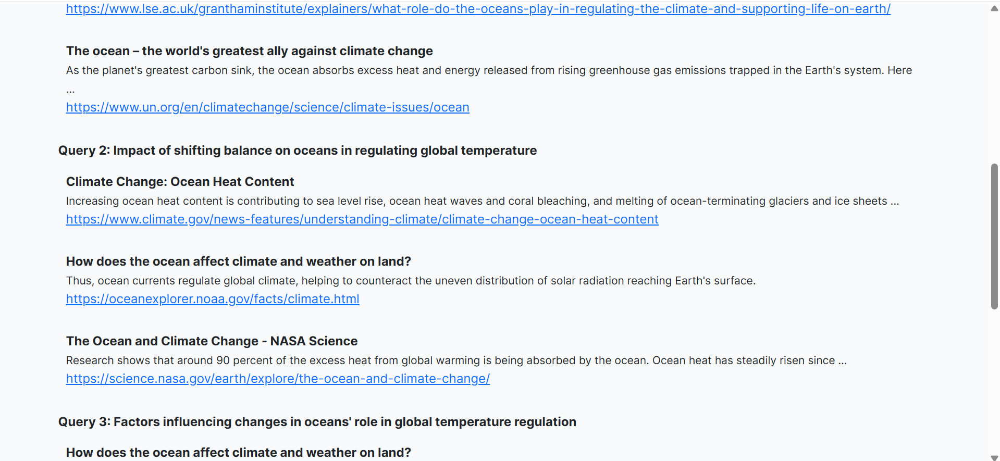
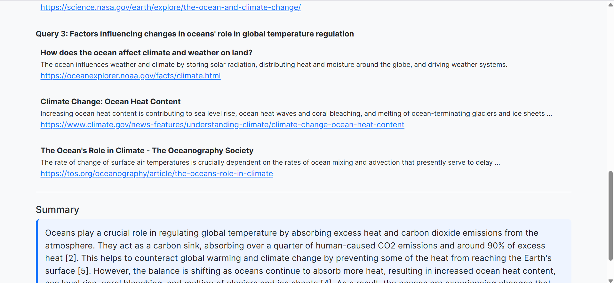

# QueryFusion 🔍🌐
**Your AI-powered research assistant for fast, cited answers using web search + GPT.**


---

## 🚀 Overview

**QueryFusion** is a Flask-based research assistant that:
- Accepts a natural language question
- Breaks it into multiple Google-style sub-queries using OpenAI GPT
- Performs real-time web search using the Serper API
- Synthesizes a concise answer using GPT-3.5
- Cites all sources used to generate the final response

---

## ✨ Features

✅ Input any research-style question  
✅ Auto-generate 2–3 focused web queries  
✅ Fetch results from the web (Serper.dev API)  
✅ Summarize with OpenAI GPT-3.5  
✅ Sources are cited clearly with numbered references  
✅ Handles low-information cases gracefully  
✅ Clean Bootstrap UI with expandable result view

---

## 📸 Screenshots

### Input + Search


### Query Breakdown + Search Results


### Summary Output with Citations


> You can create a `screenshots/` folder and add your 3 uploaded screenshots named accordingly for clean linking.

---

## 🛠️ Tech Stack

- **Frontend:** HTML, Bootstrap 5
- **Backend:** Python, Flask
- **LLM API:** OpenAI GPT-3.5-turbo
- **Search API:** Serper.dev (Google Search alternative)

---

## 🔧 Setup Instructions

### 1. Clone the repository

```bash
git clone https://github.com/aurosgit/QueryFusion.git
cd QueryFusion

### 2. Create and activate virtual environment (optional but recommended)

python -m venv venv
venv\Scripts\activate   # On Windows
source venv/bin/activate  # On macOS/Linux

### 3. Install dependencies

pip install -r requirements.txt

### 4. Create your .env file

OPENAI_API_KEY=your_openai_api_key
SERPER_API_KEY=your_serper_api_key

Do NOT commit this file.

### 5. Run the application

python app.py
Open your browser: http://127.0.0.1:5000


