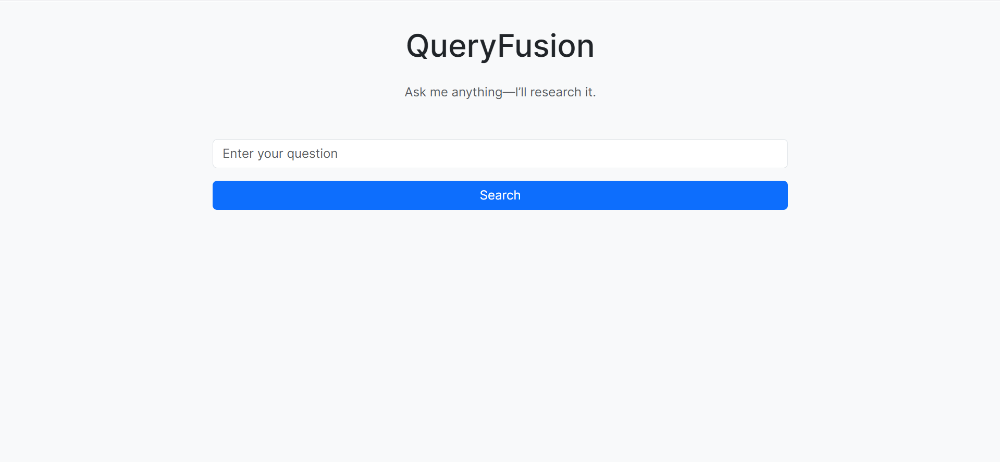
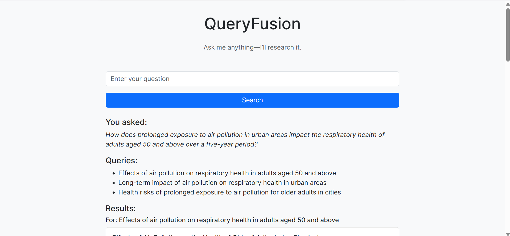
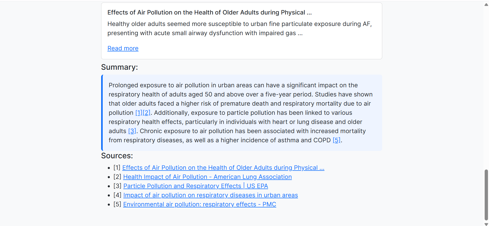

# QueryFusion 🔍🌐

**Your AI-powered research assistant for fast, cited answers using web search + GPT.**

---

## 🎥 Live Demo

🔗 [Watch the demo video on Google Drive](https://drive.google.com/file/d/1GZlspZF0mxI5XdM30G7yJRERe8WGY-KA/view)

> **Flow:** Enter a research question → GPT splits it into 3 focused sub-queries → fetch top results via Serper → GPT synthesizes a concise answer with clickable citations.

---

## 🚀 Overview

**QueryFusion** is a Flask application that:

1. **Accepts** any natural-language question.
2. **Splits** it into **3 Google-style sub-queries** via OpenAI GPT.
3. **Retrieves** top web results in real-time using the Serper.dev API.
4. **Synthesizes** a clear, concise answer with OpenAI GPT-3.5.
5. **Renders** the answer with **inline, clickable citations** (`[1]`, `[2]`, …) that scroll to numbered sources.
6. **Lists** all sources at the bottom with matching IDs (`src1`, `src2`, …).

---

## ✨ Key Features

* 📝 **Natural-language input**: ask any research question.
* 🔍 **Automated query breakdown** into three distinct sub-queries.
* 🌐 **Grouped search results** for each sub-query.
* 🤖 **GPT-powered summarization** with **interactive citations**.
* 🚫 **Graceful handling** of no-data or API errors.
* 🎨 **Responsive Bootstrap 5 UI** with custom styling in `static/style.css`.

---

## 📸 Screenshots

1. **Input & Queries**
   

2. **Grouped Search Results**
   

3. **Summary with Clickable Citations**
   

---

## 💻 Tech Stack & Project Structure

```
QueryFusion/
├─ app.py               # Flask entry point
├─ server.py            # Core logic (splitting, search, summarization)
├─ requirements.txt     # Python dependencies
├─ .env                 # API keys (not committed)
├─ templates/
│   └─ index.html       # Jinja2 template
└─ tests/
    ├─ test_utils.py    # Unit tests for helpers
    └─ test_app.py      # Integration tests for Flask routes
```

**Languages & frameworks:** Python 3.9+, Flask, Bootstrap 5, Playwright (optional)

---

## 🧪 Testing

### 1. Unit & Integration Tests (pytest)

* **Unit tests** for `get_search_queries()`, `clean_title()`, `get_summary()`, etc., mocking OpenAI & Serper calls.
* **Integration tests** using Flask’s `test_client()` to verify routes, summary anchors, and source rendering.

```bash
pip install pytest pytest-mock
pytest tests/
```

### 2. End-to-End Tests (Playwright)

Automate browser flow: load page, submit a question, verify summary & citation anchor behaviors.

```bash
pip install playwright pytest-playwright
playwright install
pytest tests/test_e2e.py
```

---

## 🔧 Setup & Run

1. **Clone the repository**

   ```bash
   git clone https://github.com/aurosgit/QueryFusion.git
   cd QueryFusion
   ```
2. **Create a virtual environment** (recommended)

   ```bash
   python -m venv venv
   # Windows:
   venv\Scripts\activate
   # macOS/Linux:
   source venv/bin/activate
   ```
3. **Install dependencies**

   ```bash
   pip install -r requirements.txt
   ```
4. **Add your `.env` file**

   ```ini
   OPENAI_API_KEY=sk-...
   SERPER_API_KEY=...
   ```
5. **Run the app**

   ```bash
   python app.py
   ```
6. **Open** `http://127.0.0.1:5000` in your browser.

Start researching with QueryFusion! 🚀
